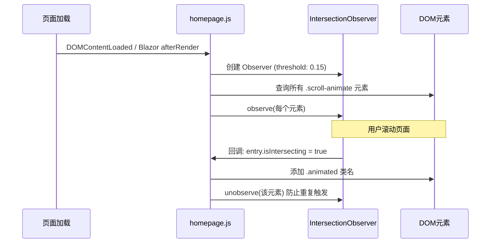
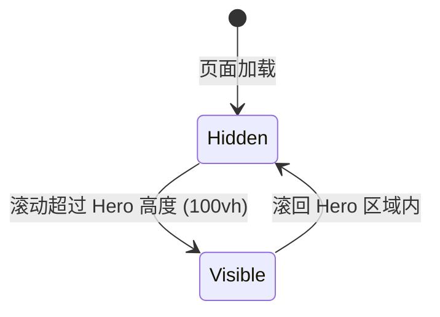

# 设计文档：首页重新设计

## 概述

本设计将水印相框大师（Davici Frame Master）官网首页从当前的平铺式布局重构为现代化全屏分区布局，参考苹果官网风格。核心改动包括：

1. 将 `MainView.razor` 重构为全屏分区（Section）结构
2. 新增 JavaScript 模块 `homepage.js`，基于 Intersection Observer API 实现滚动驱动动画
3. 新增独立样式文件 `homepage.css`，包含所有动画定义和分区样式
4. 新增固定导航栏组件，带毛玻璃效果
5. 保留现有下载链接、模板图片数据和备案信息不变

技术栈：Blazor Server (.NET 8) + MudBlazor + 自定义 CSS/JS。

## 架构

### 整体页面结构

```
┌─────────────────────────────────────┐
│  Sticky_Navigation (固定导航栏)       │  ← position:fixed, 默认隐藏
├─────────────────────────────────────┤
│  Hero_Section (100vh)               │  ← 渐变背景 + 淡入动画
│  产品名称 / 标语 / CTA按钮           │
├─────────────────────────────────────┤
│  Feature_Section                    │  ← 功能卡片 + 交错动画
│  功能特点卡片网格                     │
├─────────────────────────────────────┤
│  产品截图展示区                       │  ← 图文并排
├─────────────────────────────────────┤
│  Download_Section                   │  ← 下载按钮 + 隐私声明
├─────────────────────────────────────┤
│  Template_Gallery_Section           │  ← 12张模板网格 + 缩放动画
├─────────────────────────────────────┤
│  Footer_Section                     │  ← 深色背景 + 备案信息
└─────────────────────────────────────┘
```

### 滚动动画引擎流程



### 导航栏显示/隐藏逻辑



## 组件与接口

### 文件变更清单

| 文件 | 操作 | 说明 |
|------|------|------|
| `Components/MainView.razor` | 修改 | 重构为全屏分区布局 |
| `Components/Layout/MainLayout.razor` | 修改 | 移除 `overflow-y:hidden` 限制 |
| `Components/App.razor` | 修改 | 引入 homepage.css 和 homepage.js |
| `wwwroot/homepage.css` | 新增 | 首页专用样式和动画定义 |
| `wwwroot/homepage.js` | 新增 | 滚动动画引擎 |

### MainView.razor 组件结构

```razor
@page "/"
@rendermode InteractiveServer

<!-- 固定导航栏 -->
<nav class="sticky-nav" id="stickyNav">
    <LogoIcon /> | 产品名称 | 下载按钮
</nav>

<!-- Hero Section -->
<section class="hero-section" id="heroSection">
    产品名称 / 标语 / CTA按钮（锚点跳转到下载区）
</section>

<!-- Feature Section -->
<section class="feature-section">
    <MudGrid> 功能卡片 × 5 </MudGrid>
</section>

<!-- 产品截图展示区 -->
<section class="showcase-section">
    图文并排展示
</section>

<!-- Download Section -->
<section class="download-section" id="downloadSection">
    4个平台下载按钮 + 隐私声明
</section>

<!-- Template Gallery Section -->
<section class="gallery-section">
    标题 + 12张模板图片网格
</section>

<!-- Footer Section -->
<footer class="footer-section">
    备案信息
</footer>
```

### homepage.js 接口

```javascript
// 初始化滚动动画引擎
window.HomepageAnimations = {
    // 由 Blazor OnAfterRenderAsync 调用
    init: function() {
        // 1. 创建 IntersectionObserver
        // 2. 观察所有 .scroll-animate 元素
        // 3. 监听滚动控制导航栏显隐
    }
};
```

Blazor 端通过 `IJSRuntime.InvokeVoidAsync("HomepageAnimations.init")` 在 `OnAfterRenderAsync(firstRender)` 中调用。

### homepage.css 动画类定义

| CSS 类名 | 效果 | 用途 |
|----------|------|------|
| `.scroll-animate` | 初始状态：opacity:0 | 所有需要动画的元素基类 |
| `.fade-in.animated` | opacity: 0→1 | 通用淡入 |
| `.slide-up.animated` | translateY(40px)→0 + 淡入 | Hero文字、Section标题 |
| `.slide-left.animated` | translateX(-40px)→0 + 淡入 | 左侧内容 |
| `.slide-right.animated` | translateX(40px)→0 + 淡入 | 右侧内容 |
| `.scale-in.animated` | scale(0.8)→1 + 淡入 | 模板图片 |
| `.stagger-delay-N` | animation-delay: N*0.1s | 交错延迟（N=1~12） |

动画参数：duration 0.6s，timing-function ease-out，仅使用 `transform` 和 `opacity` 确保 GPU 加速。


## 数据模型

本次重设计主要是前端 UI 重构，不涉及新的后端数据模型。需要保留的现有数据：

### 模板图片列表（保持不变）

```csharp
List<string> strings = [
    "43F920046F064B18A4BA0B1C46408F66",
    "B735DFC73A0B4080B11BBCFD3AE833D6",
    "19BEBDE6C0C64FCB9919DDCD4A2A3675",
    "DBF0D1F09CF74F9A8E827EA04543083A",
    "C01EC81767F04D648CD055A241A61C5B",
    "D28B8DC23C9747ACBEFEF462BA8CBBCB",
    "ADD765F4905D45C38FE4A33B29D1200C",
    "2ED212541CB2403EBC86EDD028EBFEDC",
    "EF3C623CB9ED4CA68DAAE6064D5F0246",
    "59C0718464C74C5D8B1CE1FB3894E553",
    "370071180E1C41DB902C37DB84ED022C",
    "D940CF2EC7A348119837F7CB418D4CFB"
];
```

### 下载链接（保持不变）

| 平台 | URL |
|------|-----|
| Windows | `https://cdn.thankful.top/Watermark.Win.Update.exe` |
| Android | `https://cdn.thankful.top/DaVinci%20Frame%20Master-...apk` |
| macOS | `https://apps.apple.com/cn/app/davinci-frame-master/id6504527992?mt=12` |
| iPhone | `https://apps.apple.com/cn/app/...id6541761957` |

### 功能特点数据

在 `MainView.razor` 的 `@code` 块中定义功能卡片数据模型：

```csharp
record FeatureItem(string Icon, string Title, string Description);

List<FeatureItem> features = [
    new("@Icons.Material.Filled.CardGiftcard", "基础功能免费", "核心功能完全免费使用"),
    new("@Icons.Material.Filled.Devices", "会员全平台通用", "跨平台同步，一次订阅多端使用"),
    new("@Icons.Material.Filled.HighQuality", "不损失画质", "原图质量输出，无压缩损失"),
    new("@Icons.Material.Filled.Dashboard", "模板设计与编辑", "丰富模板库，自由创作编辑"),
    new("@Icons.Material.Filled.GridView", "拼图功能", "多种拼图布局，灵活组合照片")
];
```

### 导航栏状态

导航栏的显隐状态完全由 JavaScript 端管理（通过 scroll 事件 + CSS class 切换），不需要 Blazor 组件状态参与。

### 关键设计决策

1. **动画引擎放在 JS 端而非 Blazor 端**：Intersection Observer 回调频率高，放在 JS 端避免 SignalR 往返开销，性能更优。
2. **导航栏显隐由 JS 控制**：同理，scroll 事件处理放在客户端，通过 CSS class 切换实现，不走 Blazor 交互。
3. **使用独立 CSS/JS 文件**：符合需求 10.4，避免内联样式膨胀，便于缓存。
4. **保留 MudBlazor 组件**：功能卡片布局使用 `MudGrid`/`MudCard`，下载按钮使用 `MudButton`，保持与项目现有风格一致。
5. **Hero CTA 按钮使用锚点跳转**：点击后平滑滚动到 `#downloadSection`，通过 `scroll-behavior: smooth` 实现。


## 正确性属性（Correctness Properties）

*属性（Property）是指在系统所有有效执行中都应保持为真的特征或行为——本质上是对系统应做什么的形式化陈述。属性是人类可读规格说明与机器可验证正确性保证之间的桥梁。*

### 属性 1：滚动动画类名添加

*对于任意*带有 `scroll-animate` 类的 DOM 元素，当 IntersectionObserver 回调报告该元素 `isIntersecting = true` 时，该元素的 classList 中应包含 `animated` 类名。

**验证需求：3.2**

### 属性 2：动画不重复触发

*对于任意*已添加 `animated` 类名的元素，IntersectionObserver 应已对其调用 `unobserve`，后续的交叉状态变化不应再次修改该元素的类名。即 `animate(animate(element)) === animate(element)`（幂等性）。

**验证需求：3.5**

### 属性 3：动画仅使用 GPU 加速属性

*对于所有* `homepage.css` 中定义的 `@keyframes` 动画规则，其中被动画化的 CSS 属性应仅限于 `transform` 和 `opacity`，不应包含 `width`、`height`、`margin`、`top`、`left` 等触发布局重排的属性。

**验证需求：10.1**

### 属性 4：动画时长参数范围

*对于所有* `homepage.css` 中带有 `animation-duration` 或 `transition-duration` 的规则，其时长值应在 0.4s 到 0.8s 之间（含边界），且缓动函数应为 `ease-out`。

**验证需求：3.4**

### 属性 5：导航栏滚动可见性

*对于任意*滚动位置 `scrollY`，当 `scrollY > window.innerHeight`（即超过 Hero 区域高度）时，导航栏应具有可见状态类名；当 `scrollY <= window.innerHeight` 时，导航栏应处于隐藏状态。

**验证需求：4.3, 4.4**

### 属性 6：交错延迟顺序性

*对于任意*带有交错动画的元素组（功能卡片组或模板图片组），组内第 N 个元素的 `animation-delay` 值应等于 `N * 基础延迟时间`，且严格递增。

**验证需求：5.2, 7.2**

### 属性 7：功能卡片内容完整性

*对于所有*功能卡片元素，每张卡片的渲染输出应同时包含一个图标元素和对应的功能描述文字。

**验证需求：5.3**

### 属性 8：下载按钮内容完整性

*对于所有*下载按钮元素，每个按钮应同时包含对应平台的图标和平台名称文字。

**验证需求：6.2**

### 属性 9：下载链接地址保持不变

*对于所有*下载按钮，其 `href` 属性值应与现有 MainView.razor 中定义的原始下载 URL 完全一致。

**验证需求：6.4**

### 属性 10：模板图片懒加载

*对于所有* Template_Gallery_Section 中的 `` 元素，其 `loading` 属性值应为 `"lazy"`。

**验证需求：10.2**

## 错误处理

### JavaScript 初始化失败

- **场景**：`HomepageAnimations.init()` 在 Blazor `OnAfterRenderAsync` 中调用失败（如 JS 文件未加载）
- **处理**：使用 `try-catch` 包裹 JS 互操作调用，失败时页面仍可正常显示（所有 `.scroll-animate` 元素通过 CSS 回退规则 `noscript` 或超时后自动显示）
- **回退策略**：在 `homepage.css` 中添加 `.scroll-animate` 的 fallback 规则，若 3 秒内未添加 `animated` 类，则通过 CSS animation 自动显示元素

### IntersectionObserver 不支持

- **场景**：极旧浏览器不支持 Intersection Observer API
- **处理**：在 `homepage.js` 中检测 `window.IntersectionObserver` 是否存在，若不存在则直接为所有 `.scroll-animate` 元素添加 `animated` 类，跳过动画效果

### 图片加载失败

- **场景**：CDN 图片（模板图片、产品截图）加载失败
- **处理**：为 `` 元素设置 `onerror` 回退，显示占位背景色或占位图标

### Blazor SignalR 断连

- **场景**：InteractiveServer 模式下 SignalR 连接断开
- **处理**：首页为纯展示页面，所有动画和导航栏逻辑在客户端 JS 运行，不依赖 SignalR。下载按钮使用标准 `<a href>` 链接，断连后仍可点击下载。

## 测试策略

### 双重测试方法

本项目采用单元测试 + 属性测试的双重策略：

- **单元测试**：验证具体示例、边界情况和错误条件
- **属性测试**：验证跨所有输入的通用属性

### 属性测试

**测试库**：使用 [FsCheck](https://fscheck.github.io/FsCheck/) 作为 .NET 属性测试库（通过 `FsCheck.Xunit` 集成到 xUnit）。

**配置要求**：
- 每个属性测试最少运行 100 次迭代
- 每个测试必须以注释引用设计文档中的属性编号
- 标签格式：`Feature: homepage-redesign, Property {number}: {property_text}`

**属性测试覆盖**：

| 属性 | 测试描述 | 方法 |
|------|---------|------|
| 属性 1 | 生成随机 DOM 元素集合，模拟 IntersectionObserver 回调，验证 animated 类添加 | JS 单元测试 (Jest/Vitest) |
| 属性 2 | 对已动画元素重复触发回调，验证幂等性 | JS 单元测试 |
| 属性 3 | 解析 homepage.css 中所有 @keyframes，验证仅含 transform/opacity | CSS 解析属性测试 |
| 属性 4 | 解析 homepage.css 中所有动画时长，验证范围 | CSS 解析属性测试 |
| 属性 5 | 生成随机 scrollY 值，验证导航栏可见性状态 | JS 单元测试 |
| 属性 6 | 生成随机长度的元素组，验证延迟递增 | JS 单元测试 |
| 属性 7 | 渲染功能卡片组件，验证每张卡片含图标和文字 | Blazor 组件测试 (bUnit) |
| 属性 8 | 渲染下载按钮组件，验证每个按钮含图标和名称 | Blazor 组件测试 (bUnit) |
| 属性 9 | 渲染下载按钮，验证 href 与预期 URL 一致 | Blazor 组件测试 (bUnit) |
| 属性 10 | 渲染模板画廊，验证所有 img 元素含 loading="lazy" | Blazor 组件测试 (bUnit) |

### 单元测试覆盖

单元测试聚焦于具体示例和边界情况，避免与属性测试重复：

- **页面结构**：验证页面包含 5 个 Section（需求 1.1）
- **Hero 内容**：验证包含产品名称、标语、CTA 按钮（需求 2.1-2.3）
- **导航栏内容**：验证包含 Logo、产品名称、下载按钮（需求 4.2）
- **CSS 动画类型**：验证 5 种动画类型均已定义（需求 3.3）
- **备案信息**：验证 Footer 包含正确的 ICP 文字和链接（需求 8.1）
- **隐私声明**：验证下载区包含隐私协议文字（需求 6.5）
- **模板数量**：验证画廊展示 12 张图片（需求 7.1）
- **响应式断点**：验证 768px 媒体查询存在（需求 9.1）
- **IntersectionObserver 回退**：验证不支持时的降级处理
- **JS 初始化失败回退**：验证 CSS fallback 规则

### 测试工具

| 层面 | 工具 | 用途 |
|------|------|------|
| Blazor 组件 | bUnit + xUnit | 组件渲染和 DOM 结构验证 |
| 属性测试 | FsCheck.Xunit | .NET 端属性测试 |
| JavaScript | Jest 或 Vitest | JS 模块单元测试和属性测试 |
| CSS 解析 | PostCSS / css-tree (Node.js) | 解析 CSS 验证动画属性 |

