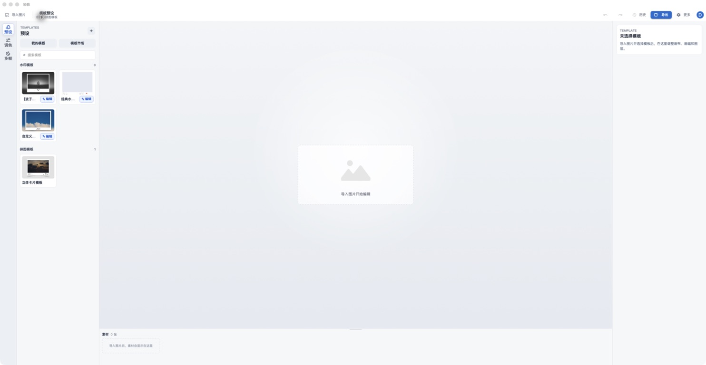
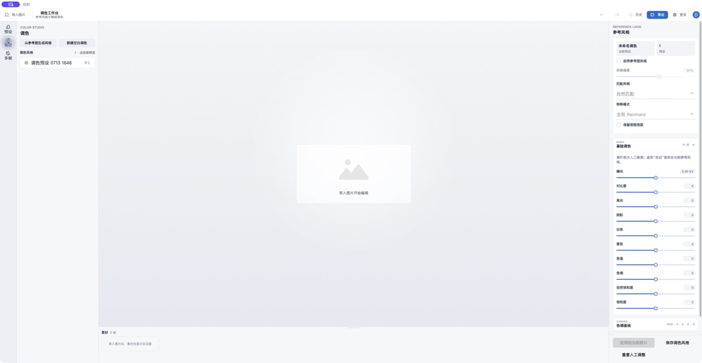
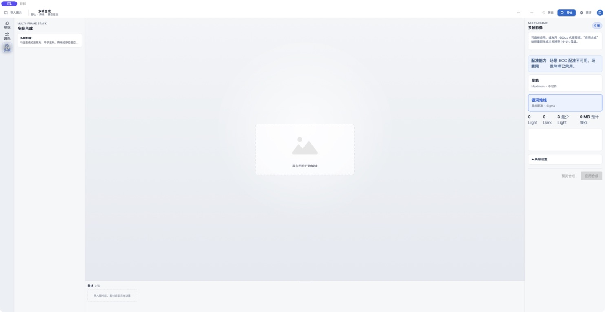

# 轻影 / Litograph

轻影是一款面向摄影后期的跨平台水印模板设计与影像处理工具。它可以读取照片的 EXIF 信息，将图片、文字、边框和元数据组织成可复用模板，并批量生成最终成片。

当前重点是 macOS（Mac Catalyst）桌面工作区，同时维护 Windows、Android 和 iOS 宿主的共享能力。



## 核心能力

- 可视化水印模板设计：图层、图片、文字、边框、画布与输出画幅
- EXIF 驱动内容：相机、镜头、焦距、光圈、快门、ISO 等信息可进入模板
- 高精度调色：16-bit 中间管线、基础调色、曲线、HSL 和参考图风格匹配
- RAW 与元数据：LibRaw 解码，并保留 JPEG EXIF、ICC 等必要信息
- 多帧合成：星轨 Maximum、银河堆栈、星点配准和 Sigma 剔除
- 批量处理：模板应用、预览缓存、latest-wins 调度和全分辨率导出
- 跨平台共享：MAUI Blazor Hybrid、WPF Blazor WebView 与共享 Razor 组件

## 界面预览

### 调色工作台



### 多帧合成



## 支持平台

| 平台 | 宿主技术 | 当前状态 |
| --- | --- | --- |
| macOS | .NET 8 MAUI · Mac Catalyst · Blazor Hybrid | 当前重点，支持 arm64 / x64 |
| Windows | .NET 8 · WPF · Blazor WebView | 支持 x64 / ARM64 原生影像后端 |
| Android | .NET 8 MAUI · Blazor Hybrid | 支持 arm64-v8a / x86_64 |
| iOS | .NET 8 MAUI · Blazor Hybrid | 支持真机 arm64 和模拟器 |
| Web | ASP.NET Core · Blazor | 保持共享代码可编译，非当前发布重点 |

## 仓库结构

```text
Watermark.Andorid/   当前 MAUI 多平台宿主（目录名沿用历史拼写）
Watermark.Razor/     跨端 Razor UI、模板编辑器和桌面工作区
Watermark.Shared/    独立私有 Git 子模块，包含共享模型和影像管线
Watermark.Win/       Windows WPF 桌面宿主
Watermark.Web/       Web 宿主
Watermark/           旧版 MAUI 宿主，仅维持兼容
native/              原生影像 ABI、构建脚本和各平台预编译产物
```

### `Watermark.Shared` 私有子模块

`Watermark.Shared` 的源码不存放在本仓库中。父仓库只记录一个 Git 子模块提交指针；实际代码位于独立私有仓库 `3egirlsdream/Watermark.Shared`。

克隆者必须拥有该私有仓库的访问权限：

```bash
git clone --recurse-submodules https://github.com/3egirlsdream/Watermark.Win.git
cd Watermark.Win
```

已经克隆父仓库时，可以补充初始化：

```bash
git submodule update --init --recursive
```

## 开发环境

- .NET 8 SDK
- macOS：Xcode 与 Command Line Tools
- Windows：Visual Studio 2022 或更新版本，安装 .NET 桌面开发和 MAUI 工作负载
- Android：Android SDK；原生依赖要求的最低 API 为 24
- 推荐 IDE：Visual Studio、Visual Studio Code 或 JetBrains Rider

## 快速构建

### macOS（Mac Catalyst）

```bash
dotnet build Watermark.Andorid/Watermark.Andorid.csproj \
  -f net8.0-maccatalyst \
  -c Debug \
  -r maccatalyst-arm64

open Watermark.Andorid/bin/Debug/net8.0-maccatalyst/maccatalyst-arm64/Litograph.app
```

签名、公证、DMG 和 App Store 发布流程见 [Watermark.Andorid/README.md](Watermark.Andorid/README.md)。

### Android

```bash
dotnet build Watermark.Andorid/Watermark.Andorid.csproj \
  -f net8.0-android \
  -c Debug
```

### Android Release APK（一键打包）

在 macOS 或 Linux 安装 .NET 8 SDK、Android SDK 和 MAUI Android 工作负载后，直接从仓库根目录执行：

```bash
./scripts/build-android-release.sh
```

脚本会还原依赖、以单进程执行完整重建，并生成当前项目版本号对应的 APK。完整重建会刷新 Android 清单和打包中间文件，避免版本号变更后误复用旧 APK。

产物位于：

```text
Watermark.Andorid/bin/Release/net8.0-android/com.top.thankful.watermark.andorid-Signed.apk
```

Release APK 使用项目本机的正式签名。首次打包前，请从
[`Watermark.Andorid/Signing/AndroidSigning.props.example`](Watermark.Andorid/Signing/AndroidSigning.props.example)
创建 `AndroidSigning.props`，填入密钥库口令、密钥别名和密钥口令；该配置和密钥库均已被 Git 忽略。详细说明见
[Android 签名目录说明](Watermark.Andorid/Signing/README.md)。

### Windows

在 Windows 开发环境运行：

```powershell
dotnet build Watermark.Win/Watermark.Win.csproj -c Debug
```

## 原生影像依赖

普通应用构建直接使用 `native/artifacts` 中已经验证的二进制，不会下载或编译 LibRaw 源码，也不会在应用运行时下载任何原生依赖。

仓库内已包含以下发布产物：

- Mac Catalyst：arm64 / x86_64 XCFramework
- iOS：arm64 真机及 arm64 / x86_64 模拟器 XCFramework
- Android：arm64-v8a / x86_64 `.so`
- Windows：x64 / ARM64 DLL

当前固定使用 [LibRaw 0.22.1 官方源码](https://www.libraw.org/data/LibRaw-0.22.1.tar.gz)，SHA-256 为 `a789dc4e2409e2901d93793a4e0b80c7b49d0d97cf6ad71c850eb7616acfd786`。本仓库不提交 LibRaw 实现源码，只保留许可与版权文件；维护者重新生成原生二进制时，需要自行取得对应官方源码并放到约定目录，构建脚本不会自动下载它。

详细的二进制清单、校验值和维护流程见：

- [原生影像后端说明](native/Watermark.Imaging.Native/README.md)
- [预编译二进制提交说明](native/NATIVE-BINARY-COMMIT.md)
- [第三方软件声明](THIRD-PARTY-NOTICES)

## 测试

```bash
dotnet test Watermark.Shared/Tests/Watermark.Shared.Tests.csproj -c Debug
dotnet test Watermark.Razor.Tests/Watermark.Razor.Tests.csproj -c Debug
```

原生 ABI 和链接验证项目位于 `native/tests`。
